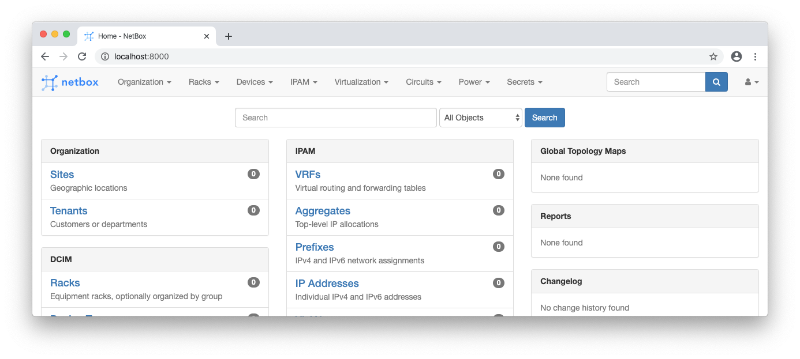

Let's start by making sure you have the correct software on your system to set up the environment you'll need to participate in the tutorial.

You should have a recent version of Docker Compose
**[TODO test for minimum docker-compose version]**

Confirm your version of Docker Compose:

```terminal
$ docker-compose --version
docker-compose version 1.25.4, build 8d51620a
```

Run the command to bring up your environment:

```terminal
$ docker-compose up
Creating network "netbox-tutorial_default" with the default driver
Creating volume "netbox-tutorial_netbox-postgres-data" with default driver
Creating netbox-tutorial_netbox-database_1 ... done
Creating netbox-tutorial_netbox_1          ... done
```

There should then be a lot more output with information about creating the containers and initializing the NetBox application. When you see a `Initialisation is done` in the output, trying going to http://localhost:8000/ in your browser. You should see the NetBox interface.

  - Username: `admin`
  - Password: `admin`

(If you get a CRSF token error, try clearing your browser cache and cookies.)


